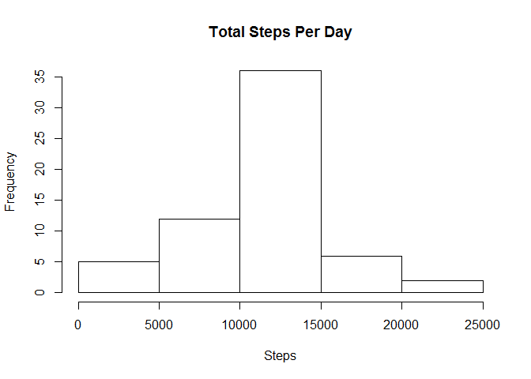

# Reproducible Research: Peer Assessment 1


## Loading and preprocessing the data

The given data is pretty clean already, the only adjust needed after loading the
uncompressed file is to convert dates from factor format to date format. We 
also attach all the needed packages now.


```r
library(dplyr)
```

```
## 
## Attaching package: 'dplyr'
```

```
## The following objects are masked from 'package:stats':
## 
##     filter, lag
```

```
## The following objects are masked from 'package:base':
## 
##     intersect, setdiff, setequal, union
```

```r
library(lubridate)
```

```
## 
## Attaching package: 'lubridate'
```

```
## The following object is masked from 'package:base':
## 
##     date
```

```r
library(lattice)
activity <- read.csv("activity.csv")
activity$date <- as.Date(activity$date)
```


## What is mean total number of steps taken per day?

We use summarise from dplyr to get the total steps per day, ignoring missing 
data, getting the following histogram.


```r
steps_day <- activity %>%
  na.omit() %>%
  group_by(date) %>% 
  summarise(total_steps = sum(steps))
plot(steps_day$date, steps_day$total_steps, type = "h",
     xlab = "Day", ylab = "Steps")
```


```r
mean_nfilled <- mean(steps_day$total_steps)
median_nfilled <- median(steps_day$total_steps)
```

The mean of the total number of steps taken per day is 1.0766189\times 10^{4}and the 
median is 10765.

## What is the average daily activity pattern?


```r
steps_interval <- activity %>% 
  na.omit() %>%
  group_by(interval) %>% 
  summarise(mean_steps = mean(steps))
xyplot(steps_interval$mean_steps ~ steps_interval$interval,
     type = "l", xlab = "Interval", ylab = "Average Steps")
```


```r
int_max_steps <- steps_interval$interval[
  which.max(steps_interval$mean_steps)]
```

The 5-minute interval which contains the maximum number of steps is 
835.


## Imputing missing values


```r
n_nas <- sum(is.na(activity))
```

There are 2304 missing values in the dataset. We are filling them with the 
mean for the 5-minute interval and not with the mean for the day, because there
are entire days with missing values.


```r
activity_filled <- activity
activity_filled[is.na(activity_filled$steps), "steps"] <-
  steps_interval$mean_steps[match(
    activity_filled[is.na(activity_filled$steps), "interval"], 
    steps_interval$interval)]
steps_day_filled <- activity_filled %>%
  na.omit() %>%
  group_by(date) %>% 
  summarise(total_steps = sum(steps), 
            mean_steps = mean(steps), 
            median_steps = median(steps))
plot(steps_day_filled$date, steps_day_filled$total_steps, type = "h",
     xlab = "Day", ylab = "Steps")
```



```r
mean_filled <- mean(steps_day_filled$total_steps)
median_filled <- median(steps_day_filled$total_steps)
```

The mean of the total number of steps taken per day in the filled dataset is 
1.0766189\times 10^{4} and the median is 1.0766189\times 10^{4}. The method used for filling 
does not affect the mean, but introduces some bias in the median.


## Are there differences in activity patterns between weekdays and weekends?


```r
wdays <- wday(activity_filled$date)
activity_filled$is_weekday <- factor(
  ifelse(wdays == 1 | wdays == 7, "weekend", "weekday"))
steps_wday <- activity_filled %>%
  group_by(is_weekday, interval) %>%
  summarise(mean_steps = mean(steps))
xyplot(mean_steps ~ interval | is_weekday, data = steps_wday, type = "l",
       xlab = "Interval", ylab = "Steps Taken - Mean", layout = c(1, 2))
```


